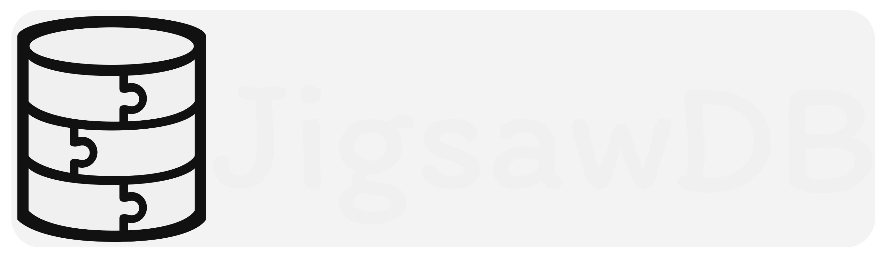

> [!WARNING]
> **JigsawDB is currently in its public beta release; there may be issues**  
> If you encounter any issues, please report them in our Discord [here](https://discord.gg/nKAZa796ua)

## What is JigsawDB?

It's a Java package made specifically to reduce the need for string-based SQL.  
It attempts to validate as much as possible at compile-time, so developers can query and write to their database **with
confidence**!

<ins>What we handle:</ins>

- **Database initialisation**
    - We use JDBC to let us execute SQL on any database you'd like!
    - We support SQLite, MySQL, MariaDB, and PostgreSQL
    - You can change databases anytime by updating one line of code!
        - It will function the exact same.
- **Table creation**
    - Whether you want to delete, add, or even modify a column, we will handle that.
    - You won't have to execute any "one-time SQL statements".
        - You don't even have to change any temporary values.
        - Everything will be done automatically on start-up.
- **Typesafe querying**
    - Everything here is typesafe, and our main goal is to make it really difficult to make any type errors.
    - It's highly configurable and is tested robustly to support many different types.
- **Caching**
    - We have a highly customizable caching system to suit all your needs!
        - Whether you want it disabled to always get the live value, we support that.
        - Or you want it enabled for blazing-fast queries, that works too.
- **Data encoding**
    - We support many different encoding types, including JSON, Enum ordinals/names, timestamps, and even Java class
      serialisation.
    - Everything is done automatically, and these encoding types are highly configurable.
    - You can even request your own encoding types in our Discord [here](https://discord.gg/nKAZa796ua) (or contribute
      your own in a PR)
- **Bucketing**
    - We have support for buckets and batch executions so your database won't get bombarded with requests.
- **Building & executing SQL**
    - Lastly and most importantly, actually reliably parsing and executing SQL.
    - Our main focus is to eliminate developers' need to write any SQL, allowing them to query and write to their
      databases **with confidence**!

## Quickstart guide

JigsawDB is published on MavenCentral:<br>
<table>
  <tr>
    <th><b>Maven</b></th>
    <th><a href="./quickstart/gradle.quickstart.md">Gradle</a></th>
    <th><a href="./quickstart/gradle.kts.quickstart.md">Gradle (kts)</a></th>
  </tr>
  <tr>
    <td colspan="3">
      *Maven already includes MavenCentral by default*
    </td>
  </tr>
</table>
And can easily be installed as a dependency with:<br>
<table>
  <tr>
    <th><b>Maven</b></th>
    <th><a href="./quickstart/gradle.quickstart.md">Gradle</a></th>
    <th><a href="./quickstart/gradle.kts.quickstart.md">Gradle (kts)</a></th>
  </tr>
  <tr>
    <td colspan="3">
      <pre lang="xml"><code>&lt;dependencies&gt;
  &lt;dependency&gt;
      &lt;groupId&gt;dev.blitical&lt;/groupId&gt;
      &lt;artifactId&gt;JigsawDB&lt;/artifactId&gt;
      &lt;version&gt;<!--VERSION-->1.0.0-beta.10<!--END_VERSION-->&lt;/version&gt;
  &lt;/dependency&gt;
  &lt;dependency&gt;
    &lt;groupId&gt;dev.blitical&lt;/groupId&gt;
    &lt;artifactId&gt;JigsawDB&lt;/artifactId&gt;
    &lt;version&gt;<!--VERSION-->1.0.0-beta.10<!--END_VERSION-->&lt;/version&gt;
    &lt;scope&gt;provided&lt;/scope&gt;
  &lt;/dependency&gt;
&lt;/dependencies&gt;</code></pre>
    </td>
  </tr>
</table>

<br>And to use it, simply create a new Table:

```java
// Define it as a table by ensuring it extends Table<YOUR_CLASS, PRIMARY_FIELD_TYPE>
public class JigsawDBTable extends Table<JigsawDBTable, UUID> {
    // There can only be one primary column, annotate it with @PrimaryColumn
    @PrimaryColumn
    @Column("UUID")
    UUID UUID;

    // Add as many additional columns as needed
    @Column("message")
    String message;
}
```

And connect to it with a database driver:

```java
public static final ConnectedDatabase DATABASE =
        new DatabaseBuilder(new SQLiteDriver("./myDatabase.sqlite"))
                .addTable(new JigsawDBTable()) // Add your table here
                .connect() // And connect with it
                .complete();
```

And now you can execute queries with ease:

```java
public static void main(String[] args) {
    // entry is never null as we are creating it if it doesn't exist
    var entry = DATABASE.getOrCreateEntry(JigsawDBTable.class, UUID.randomUUID()).complete();
    // Set the value of message to "Hello World!"
    // JigsawDBTableFields is a generated class; you may need to run your repository to be able to use it
    entry.set(JigsawDBTableFields.message, "Hello World!").complete(); // #complete() is thread-blocking
    // Get the value of string asynchronously and queue the result to be logged once received
    entry.get(JigsawDBTableFields.string).queue(result -> {
        System.out.println(result);
    });
}
```

For more information on generated classes (`JigsawDBTableFields`) or the ExecutableFuture queue system (`queue()` and
`complete()`), please take a read of our wiki [here]()

## License

JigsawDB is licensed under [GPL v3.0 license](./LICENSE).

```
Copyright Blitical 2026

Licensed under GNU GENERAL PUBLIC LICENSE version 3.
We are not liable for any damages caused by the usage,
distribution, or modification of this project.
WE PROVIDE NO WARRANTY OF ANY KIND.
```

## Social Links

- Discord: https://discord.gg/nKAZa796ua
